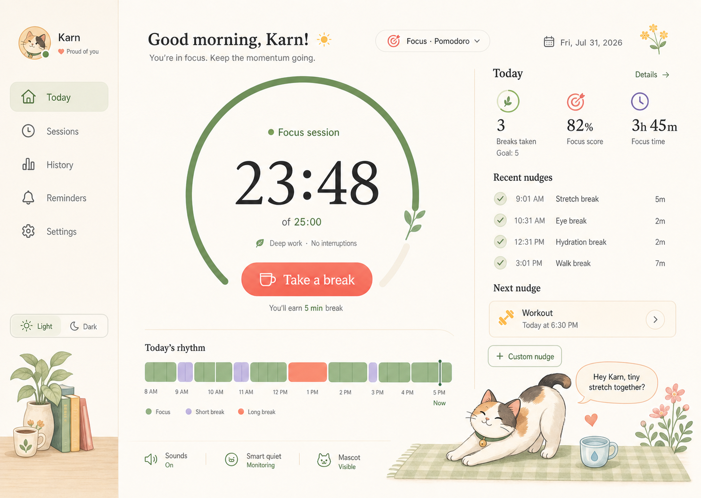
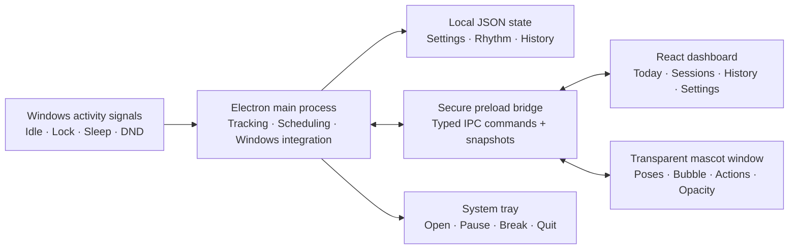

# PurrPause 🐾

**A small Windows companion that notices long work stretches and makes healthy breaks feel a little friendlier.**

PurrPause lives in the system tray, counts only the time you are actively using your computer, and sends gentle reminders for your eyes, water, posture, and movement. Its floating calico cat can stay nearby, appear only when needed, or disappear entirely while the dashboard continues working.

No account, cloud service, or productivity surveillance is required. Your rhythm, preferences, and reminder history stay on your computer.



> Made with tiny paws by [Ayush](https://github.com/ayush2599).

## Why PurrPause exists

It is easy to lose track of time while writing, designing, debugging, studying, or sitting through a busy meeting day. Ordinary alarms do not know whether you were actually working, stepped away from the computer, or were presenting something important.

PurrPause tries to solve that gently:

- It measures active computer time instead of blindly counting wall-clock time.
- It closes a focus session when Windows becomes idle, locks, sleeps, or suspends.
- It starts a fresh focus session when you return.
- It combines reminders that become due together, so the cat does not stack interruptions.
- It delays visual nudges during quiet hours and Windows presentation/DND states.
- It lets you dismiss, snooze, lower the cat's opacity, or turn the mascot off completely.

The aim is not to police your day. It is to provide a friendly little signal before a long focus stretch becomes an uncomfortable one.

## Highlights

- **Idle-aware focus tracking** — mouse/keyboard idle time, screen lock, suspend/resume, and unusual timer gaps are treated as away time.
- **Honest daily rhythm** — focus, away, short break, and long break blocks are placed on a real wall-clock timeline rather than stretched to fill the chart.
- **Accessible timeline** — blue, gray, amber stripes, and purple dots distinguish states without relying on red versus green.
- **Friendly reminders** — eye break, water, stand/stretch, walk, Pomodoro, and custom nudges.
- **A proper desktop companion** — transparent, borderless, draggable, always-on-top, resizable, and available in always-visible or reminder-only mode.
- **Quick opacity control** — right-click the floating cat and adjust its visibility without opening the dashboard.
- **Cat moods and poses** — different artwork for active, proud, sleepy, eye-break, stretch, and workout moments.
- **Gentle sound** — optional occasional meows and purrs, with an independent sound toggle.
- **Smart quiet mode** — best-effort suppression during full-screen, presentation, busy, and Windows DND states.
- **Windows startup** — installed builds can start automatically when the user signs in.
- **Local backup and restore** — preferences and history can be exported to a portable JSON file.
- **Light, dark, and system themes** — plus reduced-motion and mascot-disabled modes.

## How activity tracking works

PurrPause samples Windows idle time from the Electron main process. A focus session continues while the computer is active. Once the configured idle threshold is crossed, the tracker corrects the session back to the last user input instead of counting the idle grace period as work.

Locking Windows, putting the machine to sleep, or suspending it closes the current focus segment immediately. Returning closes the away segment and begins a new focus session. A cat reminder does not control the timer: ignoring or closing a reminder never makes inactive time count as work.

If an unacknowledged reminder remains open, it is marked as delayed after two minutes and may return after the snooze interval. If the user naturally steps away for long enough, that away period counts as a break and can satisfy a pending reminder.

## Default reminder rhythm

| Reminder | Default interval |
| --- | ---: |
| Eye break | 20 active minutes |
| Drink water | 45 active minutes |
| Stand or stretch | 50 active minutes |
| Walk or move | 90 active minutes |
| Pomodoro | 25 min focus / 5 min break |
| Long Pomodoro break | 15 min after four rounds |

These are starting points, not fixed rules. They can be changed in the dashboard, and custom nudges can run at a clock time or after a chosen amount of active time.

## Focus history and real sounds

PurrPause keeps the current day live, then archives completed focus days locally. Open **History → Focus time** to inspect a day, its total focused time, session count, breaks, and the exact timestamps of every recorded segment. The compact timeline shortens long away periods with a visible `//` gap marker; hover any block to see its real start, end, and duration.

The companion now uses offline, real cat recordings rather than synthesized oscillators. The bundled meow and purr clips are CC0 recordings by Kerzoven via OpenGameArt; their provenance is recorded in `src/assets/audio/LICENSES.md`. Cat sounds remain optional, have a separate volume control, and are deliberately rate-limited so they stay occasional.

## Architecture



The Electron main process is the source of truth. React renders snapshots and sends typed commands through the preload bridge; it does not read the filesystem or Windows APIs directly.

For a complete module map, code-flow walkthrough, asset guide, and extension recipes, read [TECHNICAL_GUIDE.md](TECHNICAL_GUIDE.md).

## Run from source

### Requirements

- Windows 10 or 11 for the complete desktop experience
- Node.js 22 or newer
- pnpm 11, available through Corepack

```powershell
corepack enable
pnpm install
pnpm dev
```

`pnpm dev` launches the Vite renderer and Electron desktop shell. Closing the dashboard hides it to the tray; use the tray menu to quit the process completely.

For renderer-only styling work:

```powershell
pnpm dev:web
```

The browser preview uses sample data. Native features such as the tray, idle detection, transparent window, Windows icon, always-on-top behavior, and drag persistence must be tested in Electron.

## Test and validate

```powershell
pnpm typecheck
pnpm test
pnpm build
pnpm test:sites
```

Activity tracking tests cover idle-tail correction, away-to-focus session boundaries, and stale sessions after a restart. Scheduler tests cover combined reminders, active-time thresholds, quiet hours, custom nudges, and cat moods.

## Build the Windows installer

```powershell
pnpm build:desktop
```

The NSIS installer is written to `release/PurrPause-Setup-<version>.exe`. It creates Start Menu and desktop shortcuts and can launch PurrPause after installation. The packaged executable and windows use `build/icon.png` as the application icon.

Community builds are unsigned unless a maintainer configures a Windows code-signing certificate. Windows SmartScreen may therefore show an “unrecognized publisher” warning.

The included GitHub Actions workflow can also build the installer. Push a version tag to create a release build:

```powershell
git tag v0.4.0
git push origin v0.4.0
```

## Project map

```text
electron/       Native windows, tray, timer, scheduling, persistence, Windows state
shared/         Types and default settings shared by Electron and React
src/            Dashboard, mascot UI, themes, artwork selection, and sounds
tests/          Activity-tracking, scheduling, and static-worker tests
build/          Windows application icon
design/         Visual reference and QA captures
scripts/        Build and capture helpers
```

## Privacy

PurrPause is local-first:

- No account is required.
- No analytics or tracking service is included.
- No screenshots, document contents, keystrokes, or mouse coordinates are recorded.
- The app reads only the duration since the last system input and Windows notification/power state.
- Settings, rhythm segments, and reminder history are stored in Electron's local application-data directory.
- Backup files are created only when the user explicitly exports one.

## Platform notes

Windows is the supported platform for installer, tray, startup, idle detection, and smart notification-state behavior. The renderer can run on macOS or Linux, but native integration is not guaranteed.

Teams presence is intentionally not read directly. That would require Microsoft Graph sign-in and tenant permissions. PurrPause instead respects the Windows notification state that Teams and presentation tools may set.

PurrPause offers general wellness reminders and does not provide medical advice.

## Contributing

Small, focused changes are welcome. Please keep the app local-first, lightweight, accessible, and easy to disable. New mascot art should use real alpha transparency, and new reminder logic should be covered by a small deterministic test.

Before opening a change, run the validation commands above and describe any Windows behavior that still needs manual testing.

## License

[MIT](LICENSE)
